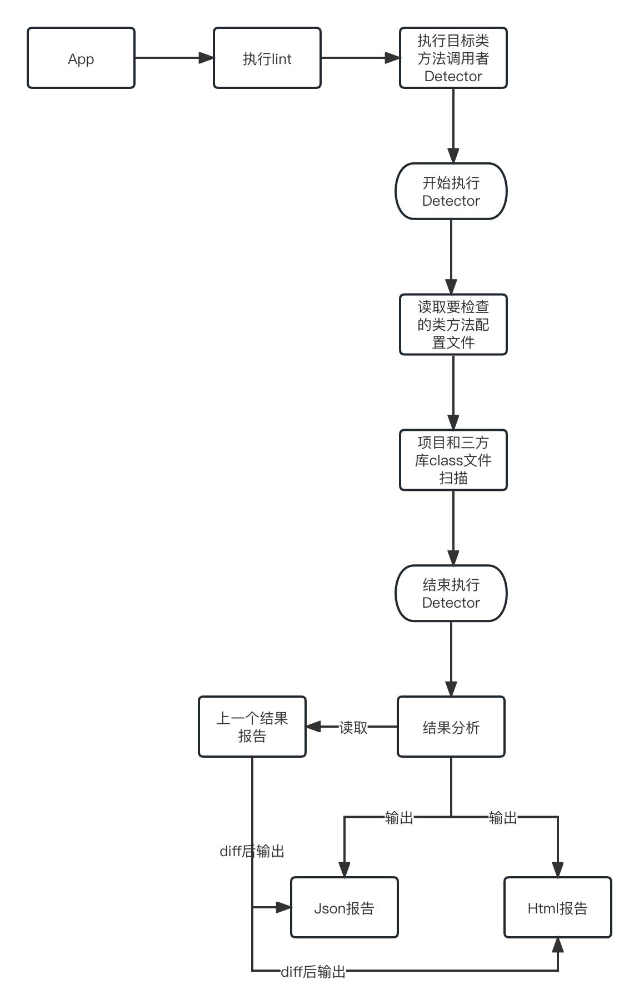

# lint_method_collector
功能更新：
  1. 支持检查项目或三方库中某个类方法使用集合；
  2. 支持检查项目或三方库中某个包下所有方法使用集合；
  3. 支持检查项目或三方库中某个包下或类中的变量使用集合；
  4. 支持检查项目或三方库中某个类方法使用集合，包括有继承关系的使用方式；
  5. To Be Continue...

自定义 lint 规则，通过扫描项目和三方库类文件，查找目标类方法调用者集合。运用场景主要包括：
  1. 查看隐私方法调用者，快速定位App违反应用市场上架规范；
  2. 在项目中，某个库方法有更改，找到所有使用的地方包括其它 aar 库；
  3. 在项目中，代码收敛，比如将所有使用 getExternalFilesDir 方法的地方都替换为一个 工具类方法；


## 技术流程
在自定义 lint 中 定义一个 Detector，用于接收 项目和三方库 class 文件扫描。在 Detector 执行过程中，将 class 和 class method 信息收集起来，等执行完成，将收集到的类方法信息与配置文件中的要检查的类方法信息进行匹配，匹配完成后输出 Json 和 Html 格式文件报告，如果有上一个执行结果，将与之 diff 后再输出结果

下面为流程图：



## 如何使用
lint-checks 主要是自定义 lint 规则，lint-library 主要是 lint-checks 的封装，所以只需要将 lint-library 打包成 arr 对外提供即可。

假设需要检查 app 模块，只需要让 app 模块依赖： `implementation project(':lint-library')`，然后命令行执行：`./gradlew :app:lint`
当然，你也可以将 `project(':lint-library')` 打包成 arr，上传到仓库或者放在 libs 文件夹下给 app 模块依赖。

或者可以将 `project: lint-library` 单独编译成 arr，这里建议编译 debug arr即可，然后放在 app 模块的 libs目录下，然后添加依赖 `debugImplementation files("libs/lint-library-debug.aar")`。

执行完成，在 app/build/method-collector-debug 目录下会生成结果报告，包含 .json 和 .html 格式报告。

### 配置文件 collector_config.json
这个文件存放在项目根目录下，由于 `MethodCollectorDetector` 中是固定路径读取，所以这个存放位置不可更改。

这个配置文件中，主要定义了要收集的目标类方法。

```
{
  "methods": [
    {
      "owner": "android/location",
      "name": "getLastKnownLocation",
      "message": "大佬，麻烦请用项目xxx库中xxx类的xxx方法获取",
      "match": "package",
      "excludes": [
        {
          "caller": "androidx/appcompat/app/TwilightManager",
          "name": "getLastKnownLocationForProvider"
        },
        {
          "caller": "android/location",
          "name": "getLastKnownLocationForProvider"
        }
      ]
    },
    {
      "owner": "android/net/wifi/WifiInfo",
      "name": "getMacAddress",
      "match": "class",
      "message": "大佬，麻烦请用项目xxx库中xxx类的xxx方法获取"
    },
    {
      "owner": "android/telephony/TelephonyManager",
      "name": "getImei",
      "message": "大佬，麻烦请用项目xxx库中xxx类的xxx方法获取"
    }
  ],
  "output": {
    "type": "single"
  }
}
```
首先 output 中的 type 的枚举值是：single 和 multi，single 表示报告都输出到一个结果文件中，multi 表示报告会输出到多个文件中；
methods 定义了目标类方法列表，其中的 excludes 表示不需要收集的类方法调用者。另外，match 的么枚举值是 package 和 class，package 表示 owner 指定的包名下的所有类，会检查 owner 包下的所有类的所有方法，excludes 中 caller 也可以指定相关包名；
class 表示 owner 指定的是具体类，只会检查 owner 类下的 name 指定的方法。

### 输出 diff 后的结果
在要检查的那个项目的 build/reports/method-collector-debug 目录下，新建 lint-method-collector.json，然后将上一个的 .json 文件结果报告的内容复制到里面。如：
```
[
  [
    {
      "ownerClassName": "android/content/Context",
      "ownerClassMethodName": "getExternalFilesDir",
      "callerClassName": "androidx/core/content/ContextCompat",
      "callerClassMethodName": "getExternalFilesDirs",
      "callerClassMethodLine": 408
    }
  ],
  [
    {
      "ownerClassName": "android/location/LocationManager",
      "ownerClassMethodName": "getLastKnownLocation",
      "callerClassName": "androidx/core/location/LocationManagerCompat",
      "callerClassMethodName": "getCurrentLocation",
      "callerClassMethodLine": 185
    }
  ],
  [
    {
      "ownerClassName": "android/telephony/TelephonyManager",
      "ownerClassMethodName": "getDeviceId",
      "callerClassName": "androidx/core/telephony/TelephonyManagerCompat$Api23Impl",
      "callerClassMethodName": "getDeviceId",
      "callerClassMethodLine": 168
    },
    {
      "ownerClassName": "android/telephony/TelephonyManager",
      "ownerClassMethodName": "getDeviceId",
      "callerClassName": "androidx/core/telephony/TelephonyManagerCompat",
      "callerClassMethodName": "getImei",
      "callerClassMethodLine": 70
    }
  ],
  [
    {
      "ownerClassName": "android/telephony/TelephonyManager",
      "ownerClassMethodName": "getImei",
      "callerClassName": "androidx/core/telephony/TelephonyManagerCompat$Api26Impl",
      "callerClassMethodName": "getImei",
      "callerClassMethodLine": 155
    }
  ]
]
```
然后这一次执行 lint ，就会输出 diff 结果。
